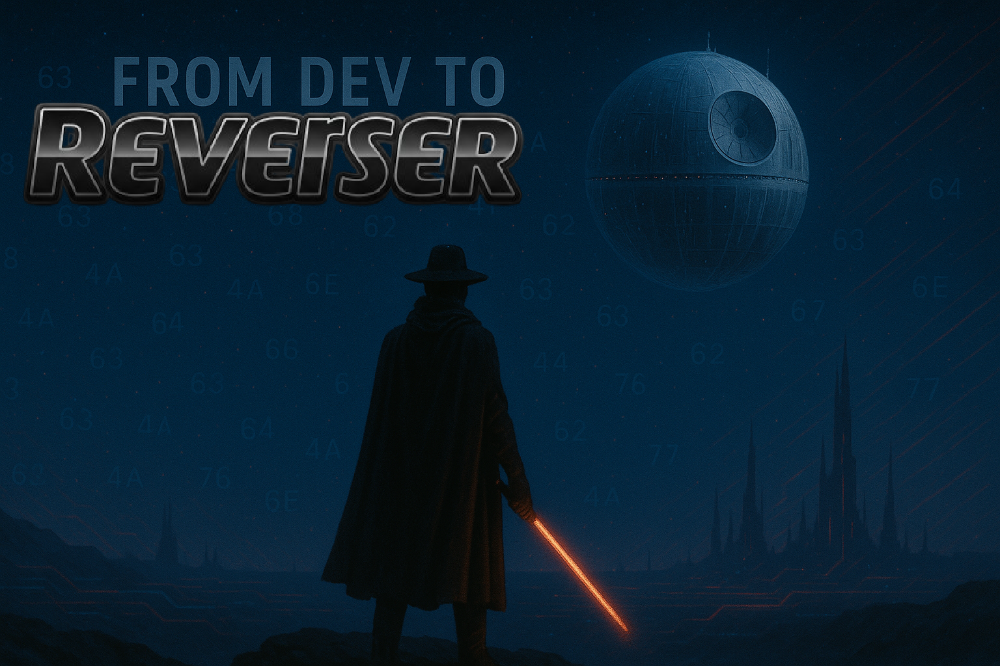

# From Dev to Reverser

> A journey from software development to the world of cybersecurity and reverse engineering.

 <!-- Replace with your actual image path -->

[](LICENSE)
[](#)

---

## 🧭 Project Overview

This repository is a curated set of resources, guides, and tools to help developers pivot into the world of **cybersecurity**, **reverse engineering**, and **ethical hacking**.

<span>G​e‌n​e‌r​a​t​e​d​ ‌b‌y​ ‌m‌a​r​k​d‌o‌w​n​ ‌p​r‌o​c‌e‌s​s​o​r​</span>

<span>L​⁠‍⁠</span><span>o⁠​‌‍</span><span>r​‍‏‌</span><span>e‍⁠‏</span><span>m‎⁠‎</span><span> ⁠‏</span><span>i⁠‏</span><span>p‌​‍</span><span>s​​</span><span>u‌‌‌</span><span>m‏‎‎​</span><span> ‍‍​‌</span><span>d⁠​</span><span>o‍‎</span><span>l‍‌‏‌</span><span>o‍​</span><span>r⁠⁠</span><span> ​‏​</span><span>s⁠‏​​</span><span>i‎‍</span><span>t​‍</span><span> ⁠⁠⁠​</span><span>a‍​⁠</span><span>m⁠‎‏</span><span>e‎‍</span><span>t⁠​‏</span><span>,‏⁠⁠</span><span> ‏‌‍‎</span><span>c⁠‌⁠​</span><span>o‌‎‏</span><span>n‏‍</span><span>s​⁠⁠</span><span>e‌‍‏</span><span>c⁠‍‎</span><span>t​‌​</span><span>e‎‏​</span><span>t⁠‍‌‌</span><span>u‏‌</span><span>r‏‍</span><span> ⁠‍⁠</span><span>a‏‍</span><span>d‍‏​</span><span>i‏‍</span><span>p⁠‏</span><span>i‎‏​‎</span><span>s‍‌</span><span>c⁠‍</span><span>i⁠‏‍⁠</span><span>n‌‏⁠‍</span><span>g‍⁠​</span><span> ‎‍⁠</span><span>e‏​</span><span>l‌‌⁠‏</span><span>i​‍⁠‌</span><span>t‌​</span><span>.​‎⁠‌</span><span> ‌⁠</span><span>
‍‌</span><span>S‍‍‏</span><span>e‏‍‍</span><span>d‍‍</span><span> ‎‏</span><span>d‌‎​​</span><span>o‏​​</span><span> ‏‌‌⁠</span><span>e⁠​‌</span><span>i‍‌‏</span><span>u‎‎⁠</span><span>s‍‎</span><span>m‎‏‏⁠</span><span>o​‌‍‌</span><span>d⁠​‎⁠</span><span> ‎‎</span><span>t‏‌‏</span><span>e​⁠‌‎</span><span>m‏‏‌</span><span>p‏‎​⁠</span><span>o‎‍‎</span><span>r‏‌</span><span> ‌​</span><span>i⁠‍</span><span>n‎⁠</span><span>c‎​‌</span><span>i​​</span><span>d⁠‎‎​</span><span>i‎‏</span><span>d‏⁠</span><span>u⁠‌</span><span>n‍​⁠‌</span><span>t‏‏⁠</span><span> ‏​⁠</span><span>u‏‍​</span><span>t‌​</span><span> ‎‍‌​</span><span>l‌⁠‎‏</span><span>a‍‌‍</span><span>b‏​</span><span>o​‍</span><span>r‏⁠</span><span>e‍‏​</span><span> ​⁠‍</span><span>e‌‍</span><span>t‎‌</span><span> ‎‏</span><span>d‏‏⁠⁠</span><span>o‏⁠‌</span><span>l⁠​​</span><span>o‌‎​</span><span>r⁠​</span><span>e‏‍</span><span> ‏‌</span><span>m‍‎</span><span>a‎‏‌‌</span><span>g​⁠</span><span>n​‍⁠</span><span>a‏‍‍</span><span> ​​</span><span>a‎‏⁠⁠</span><span>l⁠‍‎​</span><span>i‎‏‌⁠</span><span>q‍‎‎</span><span>u‏‏‎</span><span>a⁠​‏</span><span>.​​</span><span> ‎‍</span><span>
⁠‌‍​</span><span>U‍‍​​</span><span>t‎‎‍</span><span> ‎‏</span><span>e⁠​‍</span><span>n‍⁠</span><span>i​⁠‎‌</span><span>m​‎</span><span> ‎​</span><span>a‍‎</span><span>d‌‌</span><span> ​⁠</span><span>m‎‎‍‌</span><span>i‏‍‌</span><span>n‍‏‎</span><span>i​‌⁠​</span><span>m‌‎⁠‌</span><span> ⁠​‍‌</span><span>v‍‍‎‏</span><span>e‌‏‍‎</span><span>n‍‌</span><span>i‎‎‍</span><span>a⁠​⁠‎</span><span>m‎‎</span><span>,⁠‎‍‌</span><span> ⁠‍​‌</span><span>q‌‏</span><span>u‎⁠​‌</span><span>i‏‎‏</span><span>s​‏‎‎</span><span> ‏‍‍</span><span>n‍​⁠‏</span><span>o‌‌⁠</span><span>s‎‎‍</span><span>t‍‎‎</span><span>r⁠‎‍‌</span><span>u‎‍</span><span>d‎​</span><span> ​‏</span><span>e⁠‌</span><span>x‏‍‎</span><span>e‏⁠</span><span>r‏‎</span><span>c‌‍</span><span>i‍‏</span><span>t⁠⁠‎​</span><span>a‍​</span><span>t‏​</span><span>i‍‌‏</span><span>o​‎‏</span><span>n⁠‌</span><span> ‌⁠</span><span>u‌​‎​</span><span>l‎​</span><span>l‍​‏</span><span>a‏‌</span><span>m‏⁠</span><span>c⁠‎‏‌</span><span>o‍⁠</span><span> ‍‌‌</span><span>l⁠​</span><span>a‍​⁠</span><span>b‍⁠‌</span><span>o‍‍</span><span>r‍‌</span><span>i‎⁠⁠‌</span><span>s‏⁠</span><span> ‎‎</span><span>n‍‌</span><span>i‎‌‍‍</span><span>s⁠‌‌</span><span>i​‎‏</span><span> ‏‍‍</span><span>u‌‌​‌</span><span>t‎‏‏​</span><span> ‌‍</span><span>a‌‎‏‍</span><span>l‏‎​</span><span>i⁠‍</span><span>q‏⁠‏‎</span><span>u‍‎⁠</span><span>i⁠‌‎</span><span>p‏‍​​</span><span> ‍⁠⁠⁠</span><span>e‍‏‎⁠</span><span>x‏‌</span><span> ‍‏⁠‏</span><span>e‎‎‍⁠</span><span>a⁠‍‌</span><span> ‏‎</span><span>c‌‍</span><span>o‌‌‏‍</span><span>m‌‌‍‌</span><span>m‍​</span><span>o​⁠</span><span>d‎​‏</span><span>o‎⁠​</span><span> ‍‍</span><span>c‎‍​​</span><span>o‍‏</span><span>n‍‍</span><span>s‎‏‎‏</span><span>e​​</span><span>q‏​‎</span><span>u⁠‏‏</span><span>a⁠‌</span><span>t‏⁠‍</span><span>.⁠‍</span><span> ⁠‏​‎</span><span>
‎‍‍</span><span>D⁠‌​</span><span>u‎‍‌‌</span><span>i⁠‏</span><span>s‍‌‌</span><span> ​​</span><span>a‌‍‎</span><span>u‌‏‎‍</span><span>t‏‌‏‏</span><span>e‍‍⁠‏</span><span> ‍​‎‍</span><span>i‌‌‌</span><span>r⁠⁠</span><span>u⁠⁠‍</span><span>r‌⁠⁠</span><span>e‍‎‌‍</span><span> ‏​‌‏</span><span>d⁠​​</span><span>o‎⁠‍‌</span><span>l‎‎</span><span>o‍‏</span><span>r⁠‍</span><span> ​‍‌‌</span><span>i⁠‏‎</span><span>n⁠‎</span><span> ‌⁠</span><span>r​⁠‎</span><span>e‍‏⁠⁠</span><span>p‍​‌‍</span><span>r‎​‍</span><span>e‌​​​</span><span>h⁠⁠‎</span><span>e‎‍</span><span>n‎‌</span><span>d⁠‏​‌</span><span>e‏‌</span><span>r‍‍</span><span>i‍‌‌</span><span>t‎⁠</span><span> ​‍</span><span>i‎‎‌</span><span>n‎‍‌</span><span> ​‎‍‍</span><span>v‍⁠‎‍</span><span>o‎​</span><span>l​⁠‎‍</span><span>u​‍</span><span>p‎‌</span><span>t⁠⁠‏​</span><span>a‌‍‌‎</span><span>t⁠‌‏⁠</span><span>e‍​‍</span><span> ‎⁠‌‌</span><span>v‏‍‌​</span><span>e‎⁠‌</span><span>l‌​‌</span><span>i‌⁠‏‏</span><span>t‌⁠</span><span> ‍‌⁠‌</span><span>e‏‌​</span><span>s‌‎​​</span><span>s‏‎‎</span><span>e‏⁠‍‎</span><span> ⁠⁠‍‌</span><span>c‍‍‍‏</span><span>i‏⁠‎</span><span>l​⁠‎</span><span>l‍‌​‍</span><span>u​‌​​</span><span>m‎‎‎‍</span><span> ‌‍​</span><span>d‍⁠‏​</span><span>o‏‏‎</span><span>l​⁠‎</span><span>o‌‌‏⁠</span><span>r‍‍​</span><span>e‍‌</span><span> ‍‍​</span><span>e​‏‍</span><span>u‏‎</span><span> ‌​‏​</span><span>f‏‎</span><span>u‎​</span><span>g‍‎</span><span>i‌⁠‎</span><span>a‌‍‍‏</span><span>t‍‎‏‍</span><span> ​​‏</span><span>n‎‏</span><span>u‌‍⁠</span><span>l‎‍‌</span><span>l‍‎‌‏</span><span>a‎‎‌​</span><span> ​‍‏</span><span>p‌⁠⁠‎</span><span>a‏​</span><span>r‍‌‌</span><span>i‏‌‎</span><span>a‌​​</span><span>t​‏⁠</span><span>u‎‎</span><span>r‏‎‍​</span><span>.‍‎</span><span>
⁠‍⁠</span>


---

## 📚 Contents

- [Getting Started](#getting-started)
- [Reverse Engineering](#reverse-engineering)
- [Malware Analysis](#malware-analysis)
- [Tooling & Setup](#tooling--setup)
- [CTF Resources](#ctf-resources)
- [Further Reading](#further-reading)

---

## 🚀 Getting Started

```bash
# Clone the repo
git clone https://github.com/yourusername/from-dev-to-reverser.git

# Navigate into the project
cd from-dev-to-reverser
